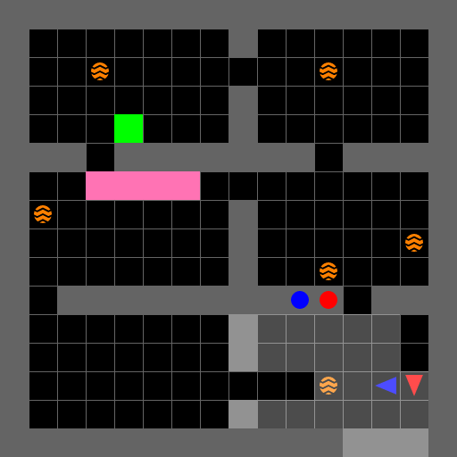
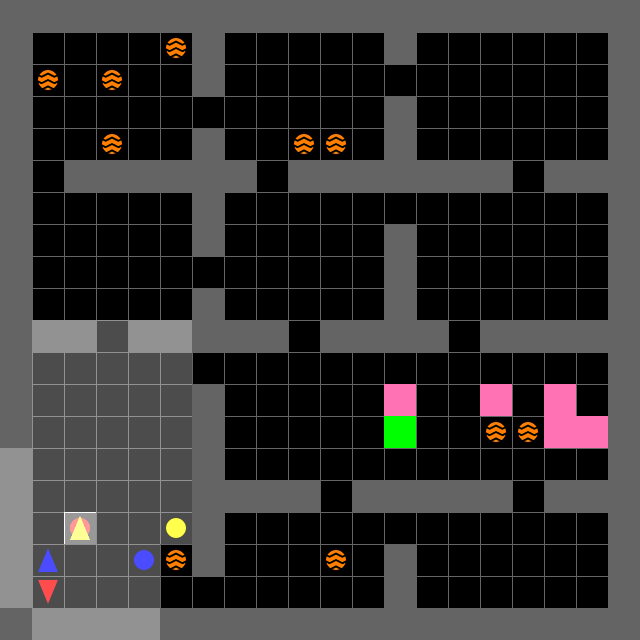

Pytorch implementation of the paper "Cooperative and Asynchronous Transformer-based Mission Planning for Heterogeneous Teams of Mobile Robots". 

## Training

You could start training with by running `sh train_gridworld.sh` in directory [matsar/scripts](matsar/scripts). 

## Evaluation

Similar to training, you could run `sh render_gridworld.sh` in directory [matsar/scripts](matsar/scripts) to start evaluation. Remember to set up your path to the cooresponding model, correct hyperparameters and related evaluation parameters. 

## Results

The performance of a model trained on a $20\times 20$ map with one rescuer agent, one explorer agent, and one randomly assigned agent per episode is visualized on the three different tasks described in the paper.

|  |  | 
|:--:| :--:| :--:| 
| Task 1 | Task 2 | Task 3 |

## Citation
The paper for this work will be available very soon!!
Authors: Milad Farjadnasab, Shahin Sirouspour
