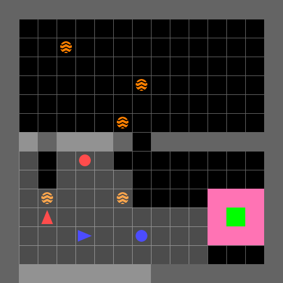
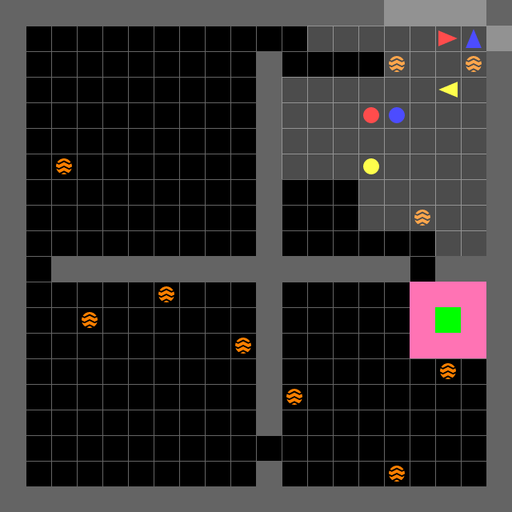
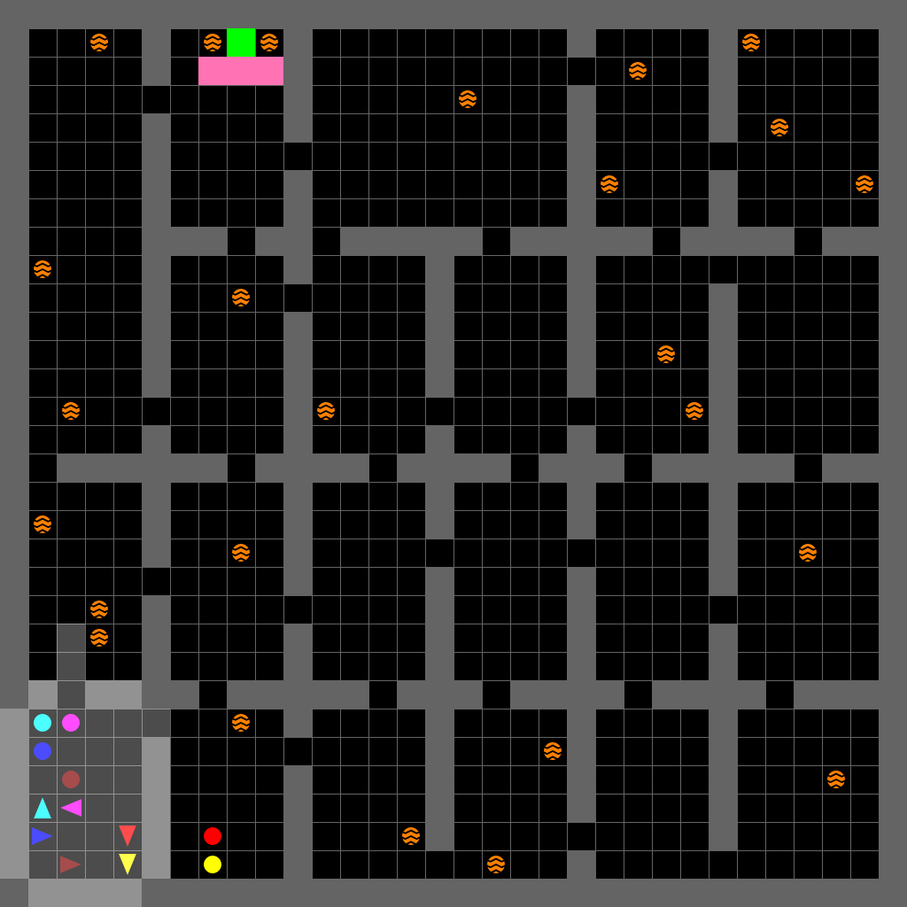

Pytorch implementation of the paper "Cooperative and Asynchronous Transformer-based Mission Planning for Heterogeneous Teams of Mobile Robots". 

## Installation

Using conda:
```
conda create -n catmip python=3.9
pip3 install -r requirements.txt
```
*Note:* If you're getting this error: "AssertionError: action space does not inherit from `gym.spaces.Space`, actual type: <class 'list'>", simply remove or comment that line from "gym/utils/passive_env_checker.py". You can do the same to get rid of any warnings as well.

## Training

You could start training with by running `sh train_gridworld.sh` in directory [hetmarl/scripts](hetmarl/scripts). 

## Evaluation

Similar to training, you could run `sh render_gridworld.sh` in directory [hetmarl/scripts](hetmarl/scripts) to start evaluation. Remember to set up your path to the cooresponding model, correct hyperparameters and related evaluation parameters. 

## Results

The performance of a model trained on a $20\times 20$ map with one rescuer agent, one explorer agent, and one randomly assigned agent per episode is visualized on the three tasks with different map sizes and team compositions, as described in the paper. The model was trained for 62500 episodes.


|  |  | 
|:--:| :--:| :--:| 
| Task 1: One rescuer and one explorer agent in a $15 \times 15$ map. | Task 2: One rescuer, one explorer, and one randomly assigned agent in a $20 \times 20$ map. | Task 3: Two rescuers (red and blue) and four explorers in a $32\times 32$ map. |


## Citation
The [preprint is now available on arXiv](https://arxiv.org/abs/2410.06372):
```
@misc{farjadnasab2024cooperative,
    title={Cooperative and Asynchronous Transformer-based Mission Planning for Heterogeneous Teams of Mobile Robots},
    author={Milad Farjadnasab and Shahin Sirouspour},
    year={2024},
    eprint={2410.06372},
    archivePrefix={arXiv},
    primaryClass={cs.RO}
}
```
